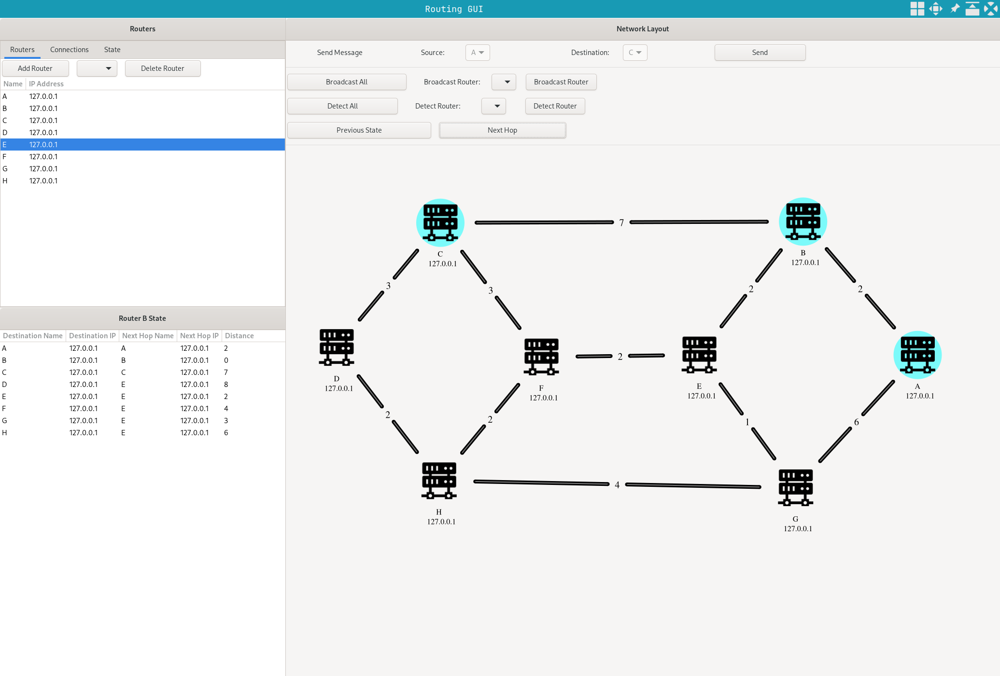

# Routing Algorithm Gui

Interactive GUI for exploring network layer routing algorithms.

## Features

- Creating custom network layouts
- Step through and replay a routing algorithm
- Fine grained control over routing process
- Interact with the network during packet routing, adding or deleting nodes
- Link State Routing (coming soon TM)

## Credits

Server Icon image from [UXWing](uxwing)

[uxwing]: https://uxwing.com
