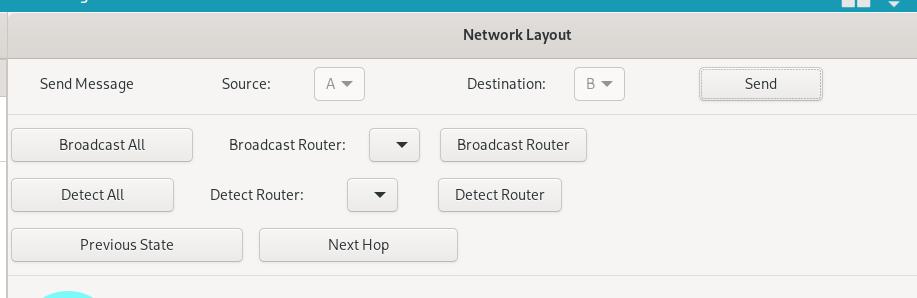

# Routing Algorithm Gui

Interactive GUI for exploring network layer routing algorithms.
Built using Golang and [Gotk][gotk] for ui elements.

## Usage


- Network layouts can be created by either adding routers and connections in the application, or loading the layout from file (see `examples/layout.txt` for an example of the format). 
This layout can be loaded at startup using

``` go run main.go -f <filename> ```

- After setting up the layout, a message can be sent between two routers.
- There are 3 basic steps to routing, broadcast, detect and next hop.



- Broadcast sends a message (not the one being routed) from a router to all neighbours. This is used to share local information at a router globally, and the specific message is implementation dependent.
- Detect updates the routers knowledge of the neighbours, specifically the distance each neighbour is from the router.
- Next hop tells the router which currently has the message to forward it to the next router.
- These actions can be undone using previous state to make different decisions during the routing process.
- The internal state of each router can be viewed by selecting a router.


To add a new routing algorithm, implement the `Router` interface from `router/state.go` and update the function `newRouter` in `main.go` to create this new router.
 
## Build 

Run `go run main.go`

## Credits

Server Icon image from [UXWing][uxwing]

[uxwing]: https://uxwing.com
[gotk]: https://github.com/gotk3/gotk3
